# Tech Challenge 2 – Pipeline de Dados B3 com AWS

## 1. Definição do Projeto

Este projeto consiste na construção de um pipeline de dados completo para extrair, processar e analisar dados de ações ou índices da B3, utilizando os serviços AWS S3, Glue, Lambda e Athena. 

A extração dos dados é realizada com a biblioteca [yfinance](https://github.com/ranaroussi/yfinance), coletando informações de 10 ações da B3. O objetivo final é apresentar a evolução percentual (positiva ou negativa) de cada papel em relação ao seu dia seguinte.

---

## 2. Arquitetura da Solução

O pipeline foi desenhado para simular um agente externo que periodicamente envia arquivos para serem processados por eventos dentro da AWS.

**Fluxo resumido:**
1. Extração dos dados via yfinance (executado fora da AWS).
2. Upload dos dados extraídos para um bucket S3.
3. O S3 gera notificações que acionam uma função Lambda.
4. A Lambda aciona um Glue Job para processar e transformar os dados.
5. O resultado é salvo novamente no S3, particionado, pronto para análise via Athena.

>
> 

---

## 3. Códigos e Componentes

- **Ingestão de Dados (yfinance):**  
  Local: `scripts/ingestao/yfinance.ipynb`  
  Responsável por extrair os dados das ações e realizar o upload para o S3.
  O particionamente é realizado baseado na data da extração. Cada extração pode conter um ou mais dias de pregao. Isso será separado na camada refined.

  

    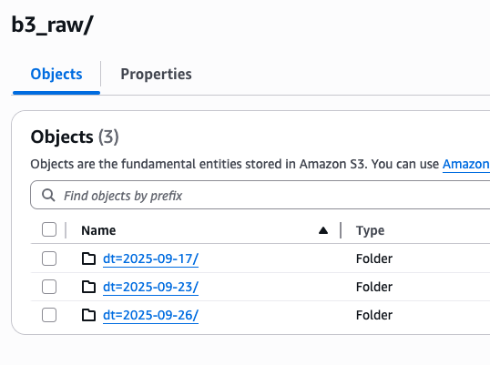
    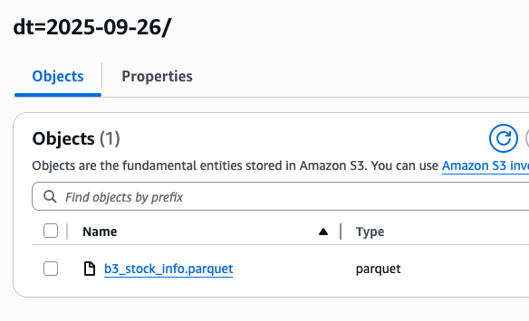
  

- **Configuração da Notificação S3 → Lambda:**  
  
    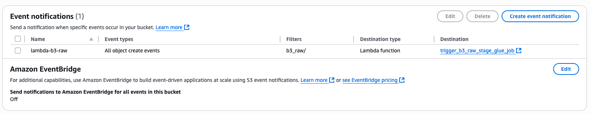

- **Função Lambda:**  
  Local: `scripts/lambda/lambda_function.py`  
  Responsável por acionar o Glue Job ao receber a notificação do S3.

    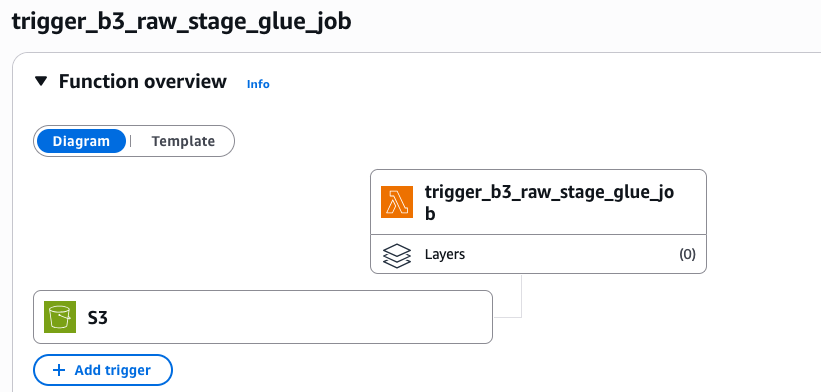
 
- **Glue Job:**  
  Local: `scripts/glue/raw_stage.py`  
  Realiza as transformações necessárias: agrupamento numérico, renomeação de colunas e cálculos baseados em datas.

    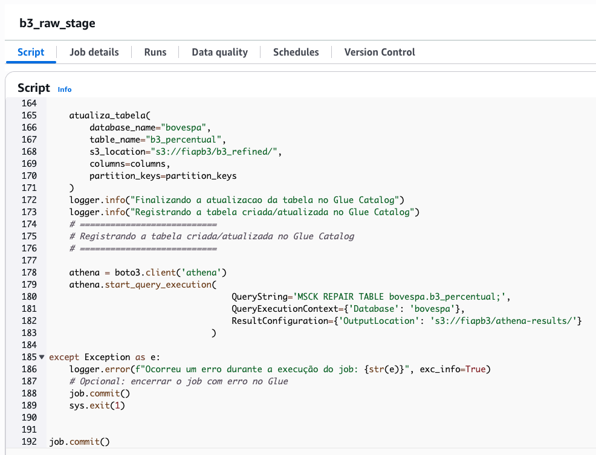
      
    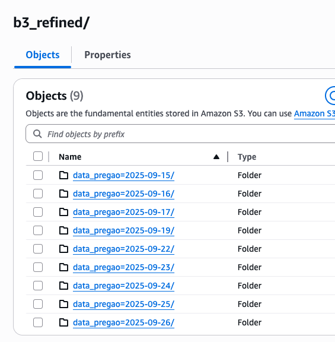
    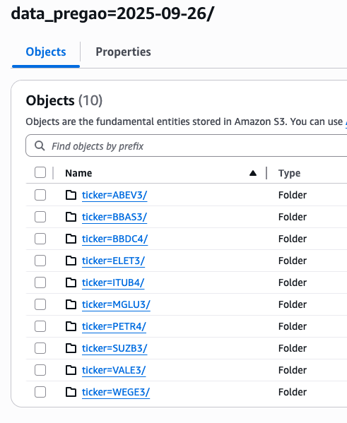
     
    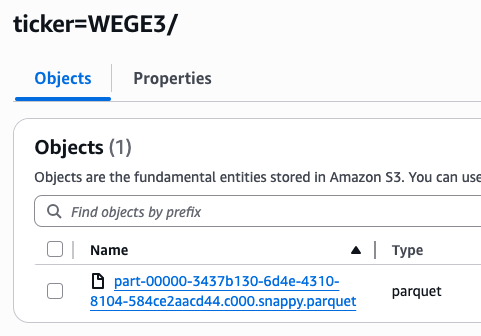

---

## 4. Athena

Após o processamento, os dados podem ser analisados diretamente no Athena.

- **Tabela criada pelo Glue Job:**  

  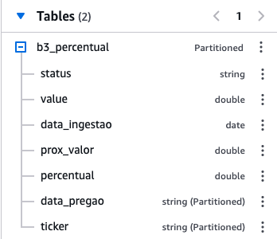

- **Definição da Tabela no Glue:**  

  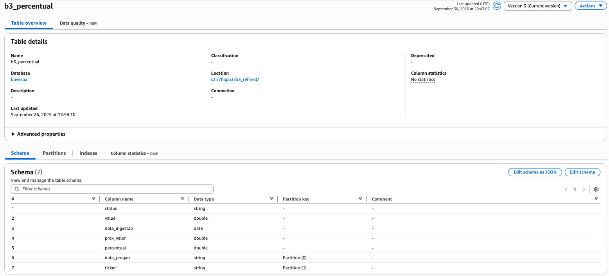

- **Exemplo de Consulta e Visualização dos Dados Finais:**  
  A coluna prox_valor apresenta a evolução percentual (positiva ou negativa) de cada papel em relação ao seu dia seguinte
  
  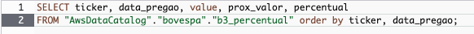
   
  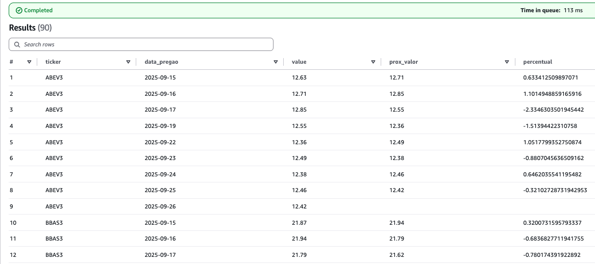

---

## 5. Pontos Importantes

- Todas as permissões necessárias no IAM foram concedidas para garantir a integração entre S3, Lambda, Glue e Athena.  
  > **Nota:** Os arquivos JSON com as permissões não estão incluídos neste repositório por questões de segurança.
- As credenciais de acesso foram removidas do código para garantir a segurança das informações sensíveis.
- Recomenda-se seguir boas práticas de segurança e governança de dados ao utilizar serviços AWS.

---

## 6. Como Executar o Pipeline

1. **Pré-requisitos:**
   - Conta AWS com permissões para S3, Lambda, Glue e Athena.
   - AWS CLI configurado.
   - Python 3.x e dependências do projeto instaladas (`yfinance`, `boto3`, etc).

2. **Execução:**
   - Execute o notebook `yfinance.ipynb` para extrair e enviar os dados ao S3.
   - Certifique-se de que a notificação do S3 está configurada para acionar a Lambda.
   - O restante do pipeline será executado automaticamente via eventos AWS.

---

## 7. Referências

- [Documentação AWS S3](https://docs.aws.amazon.com/pt_br/AmazonS3/latest/userguide/Welcome.html)
- [Documentação AWS Glue](https://docs.aws.amazon.com/pt_br/glue/latest/dg/what-is-glue.html)
- [Documentação AWS Lambda](https://docs.aws.amazon.com/pt_br/lambda/latest/dg/welcome.html)
- [Documentação AWS Athena](https://docs.aws.amazon.com/pt_br/athena/latest/ug/what-is.html)
- [yfinance](https://github.com/ranaroussi/yfinance)

---